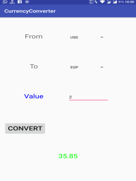

# Currency Converter App

## Introduction
The graphical user interface for an Android app is built using a hierarchy of View and ViewGroup objects. 
View objects are usually UI widgets such as buttons or text fields and ViewGroup objects are invisible 
view containers that define how the child views are laid out, such as in a grid or a vertical list. The main 
goal of this lab is to learn how to build a simple user interface.

## Objectives
After completing Lab Assignment 1, you will be able to:
* Build a simple user interface.
* Recognize the different types of layouts in Android.
* Use input controls, such as text fields, spinners and buttons
* Respond to Click events and use toasts

## App Description
In this lab, you will develop a Currency Rate Converter App (only from USD to EGP and vise versa with a 
Dynamic rate).
The App starts with the main activity allows the user to enter numeric values and choose the conversion type through spinners. 
To get rate use AsyncTask to get the rate from API then pares the retrieved JSON

## Design Requirements
The App should meet the following design requirements:
1. Use Relative Layout
2. Use TextViews for labels and result
3. Use Spinners for unit selection
4. Use EditText to enter the value
5. Save all strings in strings.xml
    • If both units are the same, the app should respond with a toast message
    • If no value entered, the app should respond with a toast message
6. Update results onClick in all cases
7. Target device is Nexus 4 – API 23

