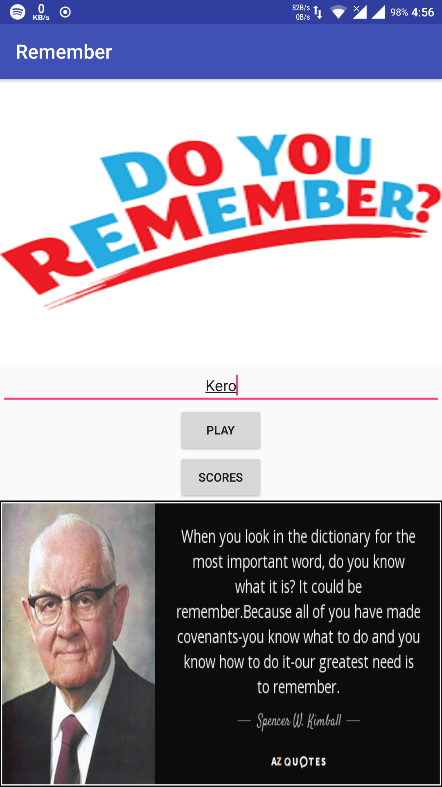
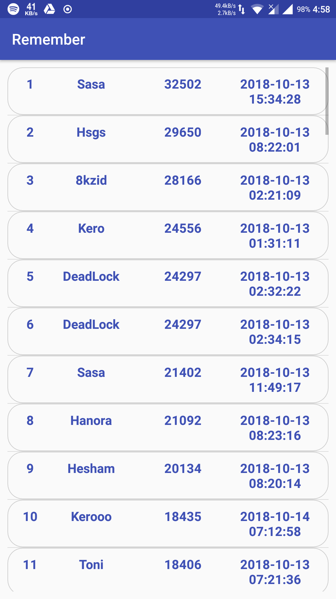
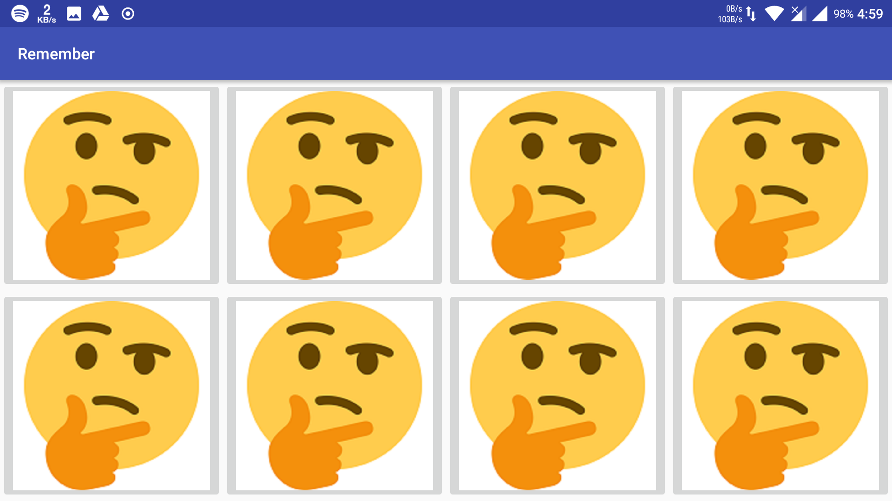
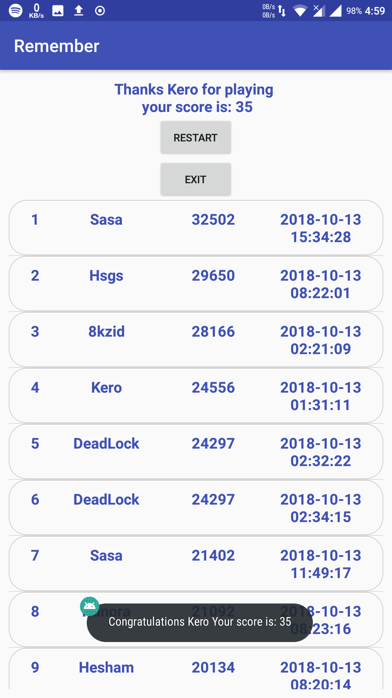

# A Matching Game App 

## Introduction
This main goal of this lab project is to learn how to build a simple commercial application that uses multiple activities, services and to design a SQLite database table to store and retrieve usernames scores, and time stamps.
Our application is mainly designed for children entering the world of preschool and beginning their paths as students but it also works with users at any age when they are learning a new language. The goal is to design a fun touchscreen application that teaches users the names of animals and birds through a memory matching game. You are free to choose the animal/birds you want.

## Objectives
### After completing Lab you will be able to:
1. Combine multiple activities in a single application.
2. Manage the life cycle of activities properly.
3. Use bundle objects to save state data to preserve the current UI state.
4. Create a SQLite database.
5. Use List Views in an application.
6. Database Helper module to access tables.

## Minimum App Design Requirements
- A simple matching game that allows the player to click on a card to see the picture behind.
- When the picture of an animal is displayed, the name of that animal is also played (as a sound file).
- The player can only see two cards at a time.
- If two pictures are matched, they will be removed from the game board.
- Score is calculated based on the game completion time – your choice!
- Players will see the score at the end of the game and they can then exit or restart the game.
- The animals/birds/ locations is set randomly at the beginning of the game.
- The app should handle the orientation changes correctly.

### For database implementation:
1. A login screen where users enter their usernames
2. A history log window
3. A database to store the usernames, scores, and timestamp

