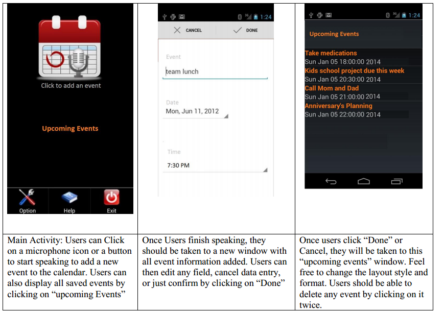

# Voice Calendar

## Introduction
This application allows users to insert appointments directly into a calendar using their own voices, you can use Android Calendar Provider API to access the system calendar.
Then Confirm it using Text To Speech

### Here are snapshots of the application layout windows:

Database Table ( at least 4 fields: ID, event, date, time)
EXAMPLE PHRASES:
    o "team lunch, Monday, Nov 5, 2018 at 7:30 pm."
    o "take medications, Tuesday, December 4, 2018 at 6:00 pm

