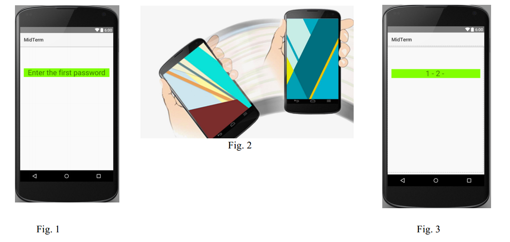
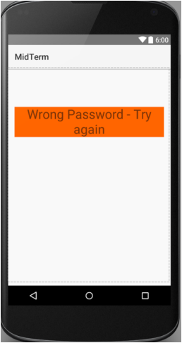
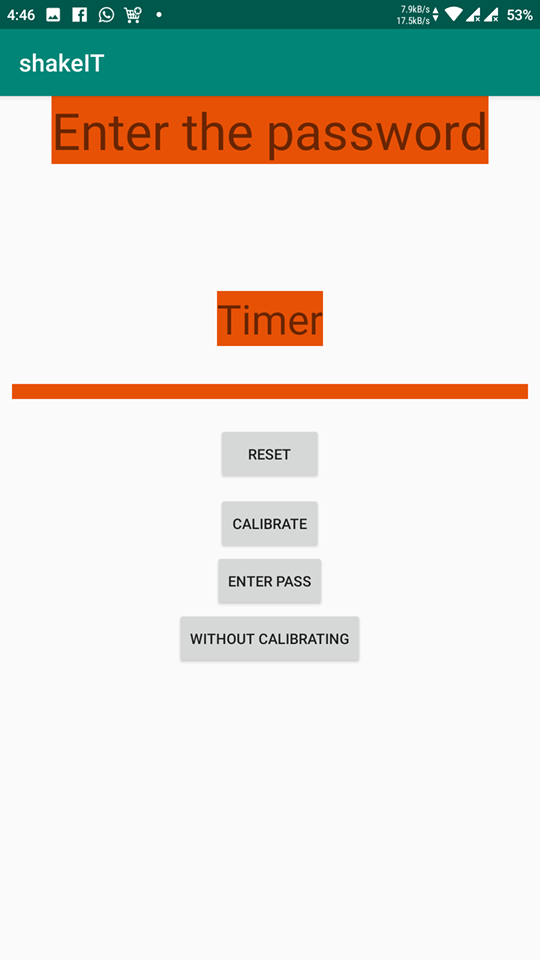

# Sensor-based Authentication App

## Introduction
Sensor-based authentication is a security auhientication procedure in which the user provides a security pass code.

## Instructions

When the user runs tha app, he/she should see the main screen in Fig. 1. This is the main activity and shows only a textview with a default text “Enter the password”.
The password is enterted by shaking the device as shown in Fig. 2 with a unique pattern (1-2-3).
Intermediate pattern check resuts should be displayed on the textview as shown in Fig. 3.

If the user starts entering the password and didn’t finish within 10 seconds or entered a wrong pattern, then the app should display a wrong password message to the user as shown in Fig. 4 and wait for another attempt. If the user entered a correct pattern, then a correct password message should be displayed.

## The Final App

